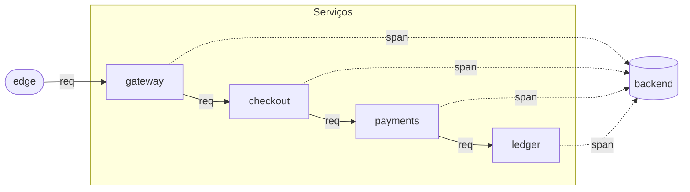

# Anatomia, reescrita em Mermaid — Exemplo

**Data:** 2026-09-16
**Companheiro de:** `2026-09-16-mermaid-como-esqueleto-design.md`

Este documento é a `anatomia` (`labs/anatomy-of-a-trace`) expressa no formato de
esqueleto proposto. Ele existe para responder a uma pergunta só: **a sintaxe da §4
aguenta um lab real?**

Comparações com o que existe hoje aparecem em nota, sem substituir nada.

---

## O arquivo `anatomy.mmd` (proposto)

Um único arquivo. Front-matter YAML, um bloco `flowchart`, `classDef` no fim. Nada
mais.

````markdown
---
id: otel-anatomy
title: One request, four processes, four exports
seed: 1
levels: [flow]
params:
  requisicoes-por-tick: 1
  derrubar-cabecalho-em: 0
  sem-instrumentacao: 0
  taxa-de-amostragem: 1
  ignorar-amostragem: 0
teaches:
  - w3c-trace-context
  - parent-based-sampler
---


````

**O que o parser vai fazer com isso** (referência §4.2 do design):

| Linha do Mermaid | Objeto no `WorldSpec` |
|---|---|
| `edge([edge]):::source` | `{ id:"edge", kind:"source", family:"processor", label:"edge" }` |
| `subgraph servicos[Serviços]` | `{ id:"servicos", kind:"composite", label:"Serviços", children:[...] }` |
| `gateway[gateway]:::servico` (dentro do subgraph) | Filho de `servicos`, `kind:"pipeline"` |
| `edge -- "req" --> gateway` | Canal de **dado**, `messageKind:"req"`, `line:"data"` |
| `gateway -. "span" .-> backend` | Canal de **controle-visual**: sólido pontilhado, `line:"data"` mas timing `settle` — ver §Nota 1 |

**Nota 1 — dado ou controle?** O span **é dado**, mas o desenho da `anatomia` usa
linha pontilhada para dizer "sai pelo lado, não pela cadeia". A convenção do
`kinds.md` reserva pontilhado para **controle**; então o exemplo mistura. Duas
saídas possíveis para o parser:

1. **Pontilhado = controle.** Aí a `anatomia` precisa mudar para linha sólida,
   perdendo a ênfase visual que hoje ela tem.
2. **Um segundo eixo, ortogonal.** Manter linha sólida/pontilhada como decisão de
   *ênfase visual* (é o fluxo primário ou é a lateral?), e mover `data`/`control`
   para um atributo do `classDef` da aresta — ou para o rótulo (`req` versus
   `control:tick`).

**A recomendação é a segunda.** Ela é o que a `anatomia` já faz sem pedir, e o
custo é uma convenção extra no rótulo:

- Rótulo sem `:` → dado, prefixo é o `kind` da mensagem.
- Rótulo com `control:` → controle.
- Linha sólida versus pontilhada → **ênfase visual**, não semântica.

Com isso, o exemplo acima passa sem reescrita, e o teste do invariante visual (§1.2
de `kinds.md`) continua verificável — ele olha o `line` do canal, não o traço do
SVG.

---

## O que precisa continuar em código TS

O Mermaid é o **esqueleto** (§3 do design). Nada aqui expressa comportamento. O
`labs/anatomy-of-a-trace/app/scenario.ts` continua tendo:

- `initialState(params)` — a `EstadoServico` de cada serviço, o `EstadoBackend`
  vazio.
- `step(state, ctx)` — o que já mora em `packages/otel-domain/src/anatomia/world.ts`:
  para cada requisição, gerar `traceparent`, decidir amostragem, emitir spans.
- `paramsSchema` — os cinco `params` do Front-matter, com tipos e limites.

**Contrato entre o esqueleto e o código:** os `id`s do Mermaid são o vocabulário
que `step` recebe. Se `step` referenciar `id: "gateway-que-nao-existe"`, o
carregador do lab recusa antes do primeiro tick. Isso é a mesma guarda que
`validateWorld` já implementa hoje.

---

## O que o motor gera sem `View` manual

O `views.ts` atual da `anatomia` tem quatro constantes (`X0`, `LARGURA_DO_SERVICO`,
`ESPACO`, `LINHA_DOS_SERVICOS`) e um `places` calculado. No formato proposto, isso
sai. O motor de layout (dagre, chamado pelo Mermaid renderer) devolve:

- Uma caixa por nó, em coordenadas do SVG.
- Um caminho por aresta, com pontos de controle.
- Uma "área" por subgrafo, que o motor usa como container de partial mode.

Para a maioria dos labs, isso basta. Para a `anatomia`, que tem uma tese
geométrica (§ o pilar "para frente / para o lado" no `world.ts`), pode não bastar
— o layout automático não sabe que o backend precisa ficar **exatamente** embaixo
de todos, cobrindo os quatro. Duas saídas:

1. **Aceitar dagre.** Layout ligeiramente diferente, tese continua legível.
2. **`anatomy.view.ts` opcional.** Um arquivo pequeno que sobrepõe posições:

```ts
// anatomy.view.ts (só o que o dagre não sabe)
export const layout = {
  places: {
    edge:    { x: 30,  y: 290 },
    backend: { x: 200, y: 260, w: 720, h: 155 },
  },
};
```

O motor combina: o que estiver no `view.ts` vence; o resto sai do dagre. Um lab
que não escrever `view.ts` nenhum ainda funciona.

---

## Onde o exemplo mostra que a sintaxe aguenta

Cinco coisas que a `anatomia` precisa e o formato entrega:

1. **Cadeia linear com fanout lateral.** As quatro setas de `req` e as quatro de
   `span` cabem sem inventar notação.
2. **Um subgrafo para "os quatro serviços".** Vira `composite` limpo, e o teste
   `views.test.ts` que hoje checa a fileira continua checando a mesma coisa.
3. **Parâmetros expostos.** Front-matter carrega os cinco `params` sem cerimônia,
   e o schema é o mesmo que `paramsSchema` do TS.
4. **Ênfase visual sem perder semântica.** A convenção "sólido para o fluxo
   primário, pontilhado para o lateral" continua, e é ortogonal a
   `data`/`control` (§Nota 1).
5. **Ancoragem para partial mode.** O `subgraph servicos` já é a chip que o
   editor colapsa. Nenhum trabalho extra.

Uma coisa que **não** aguenta e é bom saber cedo: a `anatomia` tem um estado por
serviço (`atendidas`, `exportados`, `raizesInesperadas`, `ultimaN`) e um estado
por backend (`spans`). Nenhum deles está no Mermaid — e nem deveria estar. Isso
confirma a §3 do design: comportamento e estado **não moram no esqueleto**. Se em
algum momento a gente sentir vontade de expressar o schema do estado no Mermaid,
essa é a hora de reler o design e lembrar por que a resposta é não.

---

## O próximo lab

Se o `anatomy.mmd` acima for aprovado como forma, o passo seguinte é reescrever
`labs/three-pillars/` e `labs/providers/` no mesmo molde, sem mudar nada de
comportamento. Só depois de os três labs existentes rodarem via esqueleto Mermaid
a gente ataca o parser e o carregador — porque só aí a gente sabe se a sintaxe
generaliza, e não só se ela cabe na `anatomia`.
