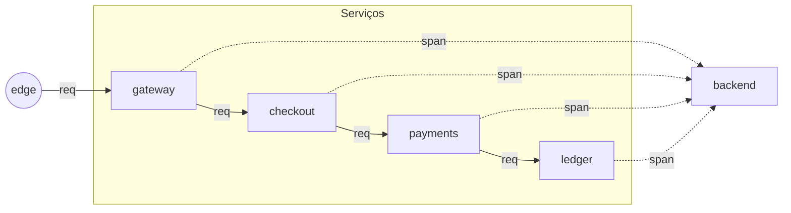

# Mermaid como esqueleto do motor — Design

**Data:** 2026-09-16
**Status:** proposta. Nada implementado.
**Depende de:** `kinds.md`, `model-format.md`, `2026-08-28-motor-composicional-design.md`
**Inspiração:** [Delineax](https://delineax.nochaos.io/) — editor de Mermaid puro, com
histórico por versão, exploração parcial de subgrafos e publicação. É "só um bom motor
de Mermaid"; o que queremos aqui é herdar essa **linguagem** e essa **experiência de
edição**, e usá-la como entrada canônica do nosso motor de simulação.

---

## 1. A tese

Hoje um lab é escrito em três lugares: a topologia (um `WorldSpec` em TS), o layout
(uma `View` em TS) e o texto. Escrever um lab novo pede saber TS de um jeito
específico, e ler um lab pronto pede rastrear três arquivos para descobrir onde entra
o que sai.

A proposta é uma **quarta representação**, que passa a ser a canônica: um bloco de
Mermaid. Ele é ao mesmo tempo:

- **Esqueleto do mundo.** Nós, canais, portas, famílias — o que hoje mora no
  `WorldSpec` e em parte no `.modelet.yaml`.
- **Hint de layout.** A ordem e o agrupamento do Mermaid definem o desenho inicial,
  suficiente para o motor renderizar sem `View` escrita à mão.
- **Documentação.** O mesmo bloco renderiza em qualquer visualizador de Markdown que
  aceite Mermaid; a página do lab consegue mostrar o esqueleto mesmo se o motor não
  carregar.
- **Entrada do editor.** O editor de labs (a coisa nova) é um editor de Mermaid, e a
  simulação viva é uma **camada por cima** — animações, medidores, controles — do que
  o Mermaid descreve.

**A regra:** o motor não sabe animar nada que o Mermaid não tenha declarado. Se um
lab quer mostrar um contador em cima de um nó, o nó precisa existir no Mermaid. Isso
mata a classe de bug em que a `View` mostra algo que o `WorldSpec` não tem.

**O que Mermaid não é:** a fonte de comportamento. Comportamento continua em `step`
funções puras (§3 mais adiante). Mermaid é **o esqueleto**; o motor é a carne.

---

## 2. Por que Mermaid (e não YAML puro, e não uma DSL nova)

Três razões, e só a última é técnica.

1. **Já se lê sem tutorial.** Todo mundo que trabalha com docs viu Mermaid no
   GitHub, no Notion, no Obsidian. Um lab escrito nele é lido antes de ser
   explicado.
2. **Ecossistema pronto.** O parser existe (`@mermaid-js/parser`, `mermaid` no
   navegador), a renderização também, e editores como o Delineax mostram que a
   experiência de edição pode ser boa sem gastar seis meses construindo IDE.
3. **A sintaxe já tem o que a gente precisa.** Nós com forma, arestas com rótulo,
   direção do grafo, subgrafos aninhados (que viram `composite`), e atributos por
   classe (`classDef`) — que é onde a nossa família e o nosso `kind` entram sem
   inventar sintaxe nova.

O que Mermaid **não** cobre e a gente vai precisar sobrepor:

- Portas nomeadas em um nó. Em Mermaid, um nó tem um único ponto de conexão. O
  contorno da §4 é usar **arestas rotuladas** e um convite de nomenclatura
  (`in:req`, `out:span`) que o parser do motor extrai.
- Parâmetros do mundo (uma taxa, um limite). Vão em um bloco Front-matter no início,
  ao lado do Mermaid, e não dentro dele.
- Comportamento. Vive em TS, referenciado por `kind` (já existe) — nada muda aí.

Uma DSL nova ganharia expressividade e perderia o resto. Uma vez que a mão dos
autores treina no Mermaid, uma DSL específica não paga o custo.

---

## 3. O que o esqueleto contém, e o que fica fora

**Contém:**

- Nós, com `kind` (do catálogo de §`kinds.md`) e nome legível.
- Canais entre nós, com rótulo (o `kind` de mensagem, no vocabulário do domínio) e
  linha (`data` ou `control`, distinguidas visualmente).
- Subgrafos, que compilam para `composite` ou `pipeline` conforme o próprio
  Mermaid já distingue (retângulo com título contra um `subgraph`).
- Portas, expressas como **rótulos convencionados** nas arestas: `in:req`,
  `out:span`, `control:tick`.
- Uma seção de parâmetros no Front-matter (YAML), lida pelo motor como
  `WorldSpec.params`.

**Fica fora, e é de propósito:**

- **Comportamento.** Como cada `kind` reage a um tick é código TS, importado por
  `kind`. Se um lab quer um `kind` novo, ele contribui um behavior novo — e o
  parser recusa o desenho até o behavior existir.
- **Estado inicial.** Também código. O Mermaid diz "aqui tem um buffer"; o estado
  inicial do buffer é decisão do behavior.
- **Layout preciso pixel-a-pixel.** O motor calcula posições a partir da topologia
  do Mermaid e do algoritmo do Mermaid renderer (dagre). Overrides finos ficam num
  arquivo `<slug>.view.ts` opcional, que ninguém precisa escrever até querer.

---

## 4. A sintaxe, em detalhe

### 4.1 Front-matter

```
---
id: otel-anatomy
title: One request, four processes, four exports
seed: 1
params:
  requisicoes-por-tick: 1
  derrubar-cabecalho-em: 0
  taxa-de-amostragem: 1
levels: [flow]
---
```

Igual ao Front-matter que Mermaid já aceita para configurar tema, e igual ao que
Astro já lê. Um lab que roda no motor precisa de `id`, `title` e pelo menos um nível.

### 4.2 O grafo



Regras de tradução para o motor:

| Mermaid | Motor |
|---|---|
| Um `id[Rótulo]` | Um nó do `WorldSpec` com `id` e `label` |
| `classDef X kind:Y,family:Z` + `id:::X` | O `kind`/`family` do nó |
| `A -- "k" --> B` (linha sólida) | Canal de **dado** com mensagem de `kind` `k` |
| `A -. "k" .-> B` (linha pontilhada) | Canal de **controle** |
| `subgraph g[Nome] ... end` | Um nó `composite` `g` com os filhos declarados dentro |
| Direção `LR`/`TB` | `layout.direction` — dagre resolve o resto |

A restrição da §3 aparece aqui: se um `classDef` referencia um `kind` que o motor
não conhece, o parser recusa, com a mesma mensagem que hoje `compileModelet` usa
("`clock` chega na onda W2"). O `.modelet.yaml` e o Mermaid convergem para o mesmo
compilador — o Mermaid é uma **fachada de sintaxe** para o mesmo modelo de dados.

### 4.3 Portas nomeadas

Um nó de vários `in`/`out` (típico do `router`) declara portas nos rótulos das
arestas:

```
router -- "req:pago"      --> aprovado
router -- "req:recusado"  --> negado
router -- "control:tick"  --. clock
```

O motor lê o prefixo antes de `:` como nome de porta. Sem prefixo, é a porta
padrão (`in` na entrada, `out` na saída). Isso é convenção, não sintaxe nova de
Mermaid — o rótulo continua sendo o rótulo que o Mermaid renderiza.

### 4.4 O que **não** entra no Mermaid

- `initialState`, `step`, `paramsSchema` — código TS, ao lado do arquivo.
- Cenários derivados (variações que só mudam `params`) — YAML, listando o
  esqueleto por referência.
- Layout manual — arquivo separado, opcional.

---

## 5. O editor: onde o Delineax entra

O motor de Mermaid do Delineax faz três coisas que a gente também quer, e não
precisamos reimplementar do zero:

1. **Live render.** Escreve à esquerda, vê à direita. É o loop natural do autor,
   e é o que um lab visualmente denso precisa para não ser escrito às cegas.
2. **Partial mode.** Um `subgraph` colapsa em uma chip; expandir mostra só a
   fatia. Em labs com trinta objetos isso é a diferença entre navegar e travar.
3. **Histórico por versão.** Cada save é uma versão. Comparação lado a lado. É a
   coisa que substitui "vou salvar isso num scratch pad".

Onde diferimos do Delineax:

- **A pré-visualização não é só o Mermaid renderizado.** É o **motor rodando**
  sobre o esqueleto que o Mermaid descreve. O autor edita a topologia à esquerda
  e vê os pacotes andarem, os medidores contarem, o backpressure subir à direita.
  Essa é a razão de existir do editor — Mermaid é meio, não fim.
- **Partial mode reflete `composite`.** Não é uma feature do editor, é a mesma
  operação de "abrir" que o `depth-core` já entende (§ da spec do motor).
  Colapsar/expandir no editor é o mesmo colapsar/expandir do leitor.
- **Publicar é abrir PR.** Não há storage próprio; a "versão publicada" é o
  arquivo `<slug>.mmd` (ou `<slug>.lab.md` com o Mermaid embutido) commitado no
  repositório.

O editor é um pacote novo, provavelmente `apps/editor`, e ele **não** precisa
estar pronto para o formato ser útil. O formato sozinho já melhora a autoria (é
possível escrever um lab novo em Mermaid + `step.ts`, sem `View` nem `WorldSpec`
escritos à mão), e o editor entra numa fase futura como conveniência.

---

## 6. O caminho

Não implementar antes de aprovar a sintaxe da §4. As fases, quando começarem:

1. **Parser Mermaid → `WorldSpec`.** Um pacote novo, `@ovh/mermaid-skeleton`, que
   consome `flowchart` do Mermaid e devolve o mesmo tipo que `compileModelet`
   devolve. Isso é o mínimo — a partir dele, qualquer lab existente pode ser
   reescrito.
2. **Reescrever a `anatomia` como validação.** Substituir `world.ts` +
   `views.ts` do lab por um `anatomia.mmd`, mantendo o comportamento. Se o teste
   `views.test.ts` continua verde e o Storybook do lab não muda, o formato
   passou no primeiro teste real.
3. **Renderizador em cima do Mermaid renderer.** Em vez de reinventar o
   posicionamento, deixar o Mermaid calcular a caixa de cada nó e a curva de
   cada aresta, e sobrepor as animações do motor em SVG. Isso substitui o
   `FlowDiagram.tsx` para labs que optaram pelo esqueleto Mermaid; os que ainda
   têm `View` manual continuam funcionando.
4. **Editor.** Só depois. Live render, partial mode, histórico.

---

## 7. Riscos, e onde a proposta pode desabar

- **Mermaid não expressa portas.** Contornado por convenção de rótulo, mas a
  convenção pode ficar frágil quando um `router` tiver oito saídas nomeadas. Um
  lab de CPU pode forçar isso; se forçar, a saída é permitir um bloco YAML
  paralelo declarando portas por id do nó.
- **Layout de dagre é bom, mas não é bonito.** Alguns labs precisam de
  disposição autoral (a fileira de quatro serviços com a árvore descendo). Já
  está resolvido em §3: um `.view.ts` opcional sobrepõe posições.
- **Duas fontes de verdade.** Existir `.modelet.yaml` **e** `.mmd` para o mesmo
  mundo é o pesadelo que este documento cria se a gente permitir os dois no
  mesmo lab. Regra dura: um lab escolhe **um** formato de esqueleto. YAML fica
  para composição de `.model` (o agregado) e Mermaid para o esqueleto do
  cenário. `.modelet.yaml` some quando o parser de Mermaid cobre os mesmos
  casos.
- **O motor precisa ler dagre.** Adiciona dependência a um pacote que hoje é
  quase sem deps. Aceito, porque a alternativa é reimplementar posicionamento.

---

## 8. O exemplo, para leitura

Em `docs/superpowers/specs/2026-09-16-mermaid-anatomy-example.md` está a
`anatomia` reescrita neste formato, junto com o Mermaid renderizado. Ele é a
prova de que a §4 aguenta o lab mais desenhado que temos hoje.
